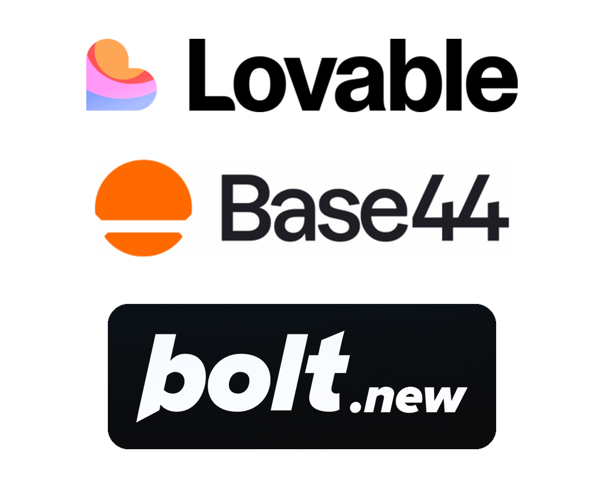
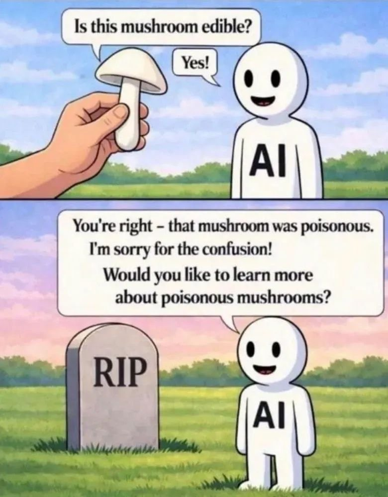
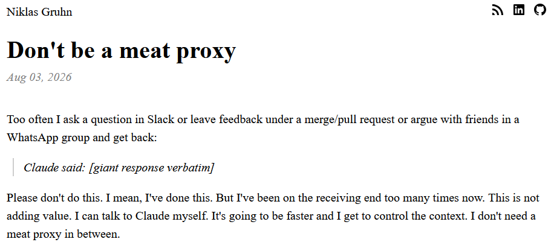

## Sobre mí {.smaller .nostretch}

:::::::: columns
::: {.column width="30%"}
{width="270px" style="border-radius: 50%; aspect-ratio: 1; object-fit: cover;"}
:::

:::::: {.column width="70%"}
::::: {style="padding-left: 1em;"}
[**María Cristina Nanton**]{style="font-size: 1.6em;"}

**Desarrolladora**\
MinSal GCBA \| The Global Health Network

::: {style="color: #555; line-height: 1.5;"}
Ciencia de datos en el sector público\
Proyectos basados en datos en red global de investigación en salud
:::

::: {style="margin-top: 1em; font-size: 0.85em;"}
[mcnanton\@gmail.com](mailto:mcnanton@gmail.com) \| [Linkedin](https://www.linkedin.com/in/mar%C3%ADa-cristina-n-920170126/) \| [Web](https://mcnanton.github.io/)
:::
:::::
::::::
::::::::

# Vibe coding...

## ... vibe coding? {.smaller}

::: {style="font-style: italic; border-left: 6px solid #999; padding-left: 0.8em; margin-top: 0.4em;"}
Hay un nuevo tipo de programación que llamo «vibe coding», donde te dejás llevar por completo por las vibras, abrazás las exponenciales y **te olvidás de que el código siquiera existe**. Es posible porque los LLM (p. ej. Cursor Composer con Sonnet) se están volviendo demasiado buenos. \[…\]

Pido las cosas más tontas, como «reducí a la mitad el padding de la barra lateral», porque soy demasiado vago para buscarlo. Siempre le doy «Accept All», **ya no leo los diffs**. Cuando me aparecen mensajes de error, simplemente los copio y pego sin ningún comentario; normalmente eso lo arregla. \[…\]

Estoy construyendo un proyecto o una webapp, pero no es realmente programar: solo veo cosas, digo cosas, ejecuto cosas y copio y pego cosas, **y casi siempre funciona**.
:::

::: {style="text-align: right; font-size: 0.8em; margin-top: 0.8em;"}
— Andrej Karpathy, Twitter, febrero de 2025 (traducción y énfasis propios)
:::

# 1 - “Hicimos algo y *funciona*”

## IAs *al alcance de todos*

Plataformas de IA generativa que dan acceso a modelos de lenguaje avanzados

:::::: {.columns style="text-align: center; margin-top: 0.8em;"}
::: {.column width="33%"}
{height="80px"}\
**Claude** - Anthropic\
[(Claude Opus 5, Sonnet 5, Fable 5.1)]{style="font-size: 0.75em; color: #555;"}
:::

::: {.column width="33%"}
{height="80px"}\
**ChatGPT** - OpenAI\
[(GPT-5.5 Instant, GPT-5.6 Sol)]{style="font-size: 0.75em; color: #555;"}
:::

::: {.column width="33%"}
{height="80px"}\
**Copilot** - Microsoft\
[(GPT-5.6, Claude Opus 5)]{style="font-size: 0.75em; color: #555;"}
:::
::::::

::: {style="margin-top: 1.2em; text-align: center;"}
Interfaz conversacional **+** maneras específicas de integrarlas en proyectos basados en código\
[Claude Code \| Codex \| GitHub Copilot \| Etc]{style="font-size: 0.7em; color: #777;"}
:::

## IAs *al alcance de todos* {.smaller}

Y también **modelos abiertos**: descargables que se pueden correr en infraestructura propia (una notebook, un servidor del instituto, una nube ya aprobada)

::::: columns
::: {.column width="55%"}
**Quién los publica**

-   **EE. UU.**: Llama 4 (Meta) · Gemma 4 (Google) · gpt-oss (OpenAI)
-   **Europa**: Mistral Small 4 (Mistral AI)
-   **China**: Qwen 3.x (Alibaba) · DeepSeek V4 · GLM-5.1 (Z.ai) · Kimi K2 (Moonshot)

**Qué hace falta para correrlos**

-   Chicos: una notebook
-   De frontera: servidores con varias GPUs
:::

::: {.column width="45%"}
**Cómo se corren**

-   En tu computadora o en un servidor

**Qué se gana**

-   Privacidad: el dato no viaja a un proveedor
-   Sin términos de servicio cambiantes
-   Costo previsible: hardware, no tokens
:::
:::::

::: {.fragment style="margin-top: 0.8em; text-align: center; font-style: italic;"}
Si corre en infra propia, el dato no sale de la institución.
:::

## Plataformas de «vibe coding»: describís la app y aparece (hasta se publica!) {.smaller}

::::: columns
::: {.column width="55%"}
-   Un chat y una vista previa en vivo: describís lo que querés en lenguaje natural y la plataforma genera **frontend, backend, base de datos y login**, y lo publica con un clic
-   No hay nada que instalar ni *programar*: el resultado es un producto usable y accesible via URL pública
-   Ejemplos\
    **Lovable**\
    **Base44**\
    **Bolt.new**\
    **Replit**\
    **Claude Code**\
    ...
:::

::: {.column width="45%"}
{width="90%" style="border-radius: 10px; box-shadow: 0 2px 10px rgba(0,0,0,0.25);"}
:::
:::::

## ¿Qué productos salen de ahí? {.smaller}

::::: columns
::: {.column width="45%"}
**Productos como**

-   Sitios institucionales y landings
-   Formularios con validación y login
-   Tableros y dashboards
-   Prototipos para mostrar a un comité o financiador
:::

::: {.column width="55%"}
**Algunos ejemplos que ví**

-   Prototipo de publicación digital para organización académica
-   Sitio para la formación de estudiantes, con LLM integrado para responder preguntas
-   Herramienta para gestión de alumnos y proyectos de investigación
:::
:::::

## En resumen: autonomía y velocidad {.nostretch}

::::: columns
::: {.column width="45%"}

::: {style="margin-top: 2em;"}
-   Prototipos en días u horas
-   Iteraciones más rápidas
-   Menos (o nada de) intermediarios
:::

:::

::: {.column width="55%"}
{fig-align="center" width="50%"}
:::
:::::

## Entre prototipo y producción (1/2) {.smaller .nostretch}

::::: columns
::: {.column width="55%"}
Algunas preguntas que suelen presentarse:

::: {.incremental}
-   ¿Cómo integro esto en la plataforma de mi institución?
-   ¿Cómo integro herramientas específicas: login institucional, calendarización, otras plataformas?
-   ¿Cómo lo pago cuando supero el plan gratuito o cambian los términos del servicio?
:::
:::

::: {.column width="45%"}
:::: {style="margin-top: 1.5em;"}
{fig-align="center" width="75%"}
::::
:::
:::::

## Entre prototipo y producción (2/2) {.smaller .nostretch}

::::: columns
::: {.column width="55%"}
:::: {style="font-size: 1.15em;"}
::: {.incremental}
-   ¿Cómo sé que los datos que ingresan mis usuarios (o los que yo ingresé) están seguros?
-   ¿Qué tan difícil es levantar esto de cero en mi organización?
:::
::::
:::

::: {.column width="45%"}
:::: {style="margin-top: 1.5em;"}
{fig-align="center" width="75%"}
::::
:::
:::::

# 2 - Aprovechar la autonomía sin generar(nos) un problema

## Trabajo con datos sensibles

**Piso normativo**

-   Por región: desde marcos muy detallados hasta contextos con regulación general pero sin guías específicas sobre IA
-   Institucional: puede existir o no
-   Que no haya una norma que lo prohíba explícitamente no lo hace seguro o ético

## Trabajo con datos sensibles {.smaller}

**Piso propio** — tres preguntas antes de empezar

::: incremental
-   ¿Puedo reconstruir la identidad de una persona con los datos que utilizo?
-   ¿Quién va a acceder a los datos y en qué entorno?
-   ¿Hay expectativas sobre cómo se tratan?
:::

::: {.fragment style="margin-top: 0.8em; padding: 0.6em; background: #f5f5f5; border-radius: 8px; font-style: italic;"}
Viejos problemas, amplificados: un Google Doc se queda donde lo dejaste; un prompt puede terminar en datos de entrenamiento, y una app generada con Lovable puede publicar la base de datos en internet.
:::

## Un ejemplo reciente (1/2): créditos de IA para investigar enfermedades raras {.smaller}

::::: columns
::: {.column width="80%"}
**Anthropic, programa AI for Science** — convocatoria temática (jul 2026)

-   Hasta **USD 50.000 en créditos de Claude** por seis meses; postulación hasta el 2 de agosto de 2026
-   Dos tracks: **ciencia básica** y **biotechs en etapa temprana** (dosis iniciales, biomarcadores, documentación regulatoria)
-   El argumento: \~400 millones de personas con alguna de más de 7.000 enfermedades raras; poblaciones chicas, datos dispersos, mecanismos compartidos difíciles de detectar
:::

::: {.column width="20%"}
{width="100%"}
:::
:::::

::: {style="text-align: right; font-size: 0.7em;"}
Fuente: [anthropic.com/news/rare-disease-research-grants](https://www.anthropic.com/news/rare-disease-research-grants)
:::

## (2/2): "falta un marco seguro para datos de pacientes" {.smaller}

**Julien Gagneur** (Universidad Técnica de Múnich)

-   Los **términos no sirven para datos clínicos o genómicos de pacientes**: quien acepta créditos garantiza que Anthropic puede recolectar, analizar y **entrenar modelos** con todos los inputs y outputs, con **licencia perpetua e irrevocable**
-   Tener permiso para *analizar* datos no es tener permiso para *transferirlos* a un tercero: la carga de gobernanza y el riesgo legal pasan al investigador y a su institución

## (2/2): "falta un marco seguro para datos de pacientes" {.smaller}

-   Un agente conectado al entorno local lee archivos, corre comandos y envía outputs con tus credenciales: **el dato puede salir sin que nadie lo suba**, sobre todo si se aprueba código sin revisarlo
-   Propuesta: un **modo de investigación protegido** — sin entrenamiento ni licencia sobre datos de pacientes, procesamiento dentro del entorno aprobado, controles auditables y un acuerdo de procesamiento claro. Código, métodos y evaluaciones, abiertos

::: {style="text-align: right; font-size: 0.7em;"}
Fuente: [medium.com/\@gagneur — "…need a safer framework for patient data"](https://medium.com/@gagneur/anthropics-ai-for-science-rare-disease-research-grants-need-a-safer-framework-for-patient-data-de319ce8f05b)
:::

## Shadow AI: de qué hablamos

::: {style="border-left: 6px solid #999; padding-left: 0.8em; margin-top: 0.6em; font-size: 1.1em;"}
**Shadow AI** es el uso no autorizado de cualquier herramienta o aplicación de inteligencia artificial por parte de empleados o usuarios finales, **sin la aprobación formal ni la supervisión del área de TI**.
:::

::: {style="text-align: right; font-size: 0.7em; margin-top: 0.6em;"}
— [IBM, «What is shadow AI?»](https://www.ibm.com/think/topics/shadow-ai) (2024, traducción propia)
:::

::: {.fragment style="margin-top: 1.2em;"}
Riesgos nuevos: qué datos se envían a plataformas y modelos comerciales de manera voluntaria e involuntaria, cómo se integran a los activos institucionales las salidas de un modelo.
:::

## Shadow AI: el caso Samsung (ojo: 2023) {.smaller}

-   **2022**: lanzamiento ChatGPT
-   **Marzo 2023**: Samsung levanta una restricción previa y habilita ChatGPT
-   **Marzo-Abril 2023**: un ingeniero pega el código fuente completo de un programa de su base de datos de semiconductores para pedir una corrección; otro hace lo mismo con el código de un equipo defectuoso; un tercero sube una reunión entera para que le arme las minutas
-   **Medida de emergencia**: limitación de largo de prompts
-   **Mayo**: vuelve la prohibición, ahora para toda herramienta de IA generativa. El motivo, según memo interno: lo que se transmite queda en servidores externos, es difícil de recuperar o borrar y podría terminar expuesto a otros usuarios

::: {.fragment style="margin-top: 0.8em; text-align: center; font-style: italic;"}
Nadie quiso filtrar nada: cada uno estaba resolviendo un problema de trabajo con la herramienta que tenía a mano
:::

::: {style="text-align: right; font-size: 0.7em; margin-top: 0.6em;"}
Fuentes: [The Register, 6/4/2023](https://www.theregister.com/2023/04/06/samsung_reportedly_leaked_its_own) · [Gizmodo, 4/2023](https://gizmodo.com/chatgpt-ai-samsung-employees-leak-data-1850307376) · [Bloomberg, 2/5/2023](https://www.bloomberg.com/news/articles/2023-05-02/samsung-bans-chatgpt-and-other-generative-ai-use-by-staff-after-leak)
:::

## Por qué aparece Shadow AI en el 2026 {.smaller .nostretch}

::::: {.columns style="display: flex; align-items: center;"}
::: {.column width="55%"}
-   Organizaciones sin equipo de IT dedicado (o sin disponibilidad para equipos interesados en IA)
-   Falta de financiación para IA institucional
-   Falta de conocimiento técnico para desplegar IAs en un marco de gobernanza institucional
:::

::: {.column width="45%"}
{fig-align="center" width="80%"}
:::
:::::

## Dónde puede salir el dato {.smaller}

::::: columns
::: {.column width="50%"}
**¿Qué dato?**

*Confidencial*

-   Credenciales y claves: en un `.env`, en el código, en una captura de pantalla
-   Bases de datos y planillas con datos de personas (pacientes, participantes, personal)
-   Historias clínicas, resultados, muestras

*Privado*

-   Características de mis proyectos u organización
-   Código, protocolos y documentos internos
:::

::: {.column width="50%"}
**¿Por dónde?**

-   **El prompt**: «te pego la tabla así me ayudás»

-   **El directorio compartido**: IA con acceso a una carpeta lee todo lo que hay ahí

-   **Los términos del servicio**: el proveedor guarda inputs y outputs y, según el plan, entrena con ellos

-   **Lo que la IA genera**: apps con URL pública y base de datos sin reglas de acceso; repos con credenciales adentro

-   **Las integraciones**: conectores a Drive, mail o calendario; extensiones del navegador
:::
:::::

## Ejemplos de políticas universitarias {.smaller}

:::::: columns
::: {.column width="33%"}
[**Harvard**](https://www.huit.harvard.edu/ai/guidelines)

-   Nada confidencial en herramientas públicas: datos de investigación, información médica, registros de personal (ni para minutas de reuniones!)
-   Con la configuración por defecto, lo que se comparte no es privado
-   Herramientas aprobadas, contratadas por universidad, específicas para datos sensibles
:::

::: {.column width="36%"}
[**Penn State**](https://researchsupport.psu.edu/orp/education/generative-ai-in-research/)

-   Desidentificar no es infalible: la IA puede inferir identidades
-   Los metadatos también identifican: nombres de archivo, geolocalización, fechas
-   Nada identificable sin aprobación del CE
-   Investigadores deben obtener consentimiento de participantes si se usa IA generativa para analizar o procesar sus datos
:::

::: {.column width="30%"}
[**Sheffield**](https://sheffield.ac.uk/rpi/pgr/guidance-pgrs-use-genai)

-   Datos sensibles o propietarios: prohibidas las IAs comerciales
-   [Herramienta auto guiada de evaluación de riesgos y usos](https://shef.qualtrics.com/jfe/form/SV_djv3Eom5ZrQum6a)
:::
::::::

## Criterios mínimos antes de usar IA con datos sensibles (1/2) {.smaller}

::: incremental
1.  **¿Qué dato es?**\
    Clasificarlo *antes* de abrir el chat: público, interno o confidencial
2.  **¿Con qué herramienta?**\
    Aprobada por la institución, con contrato que prohíba entrenar con tus datos
3.  **¿Quién lo autorizó?**\
    Datos de pacientes o participantes → comité de ética + acuerdo de datos, antes de empezar
:::

## Criterios mínimos antes de usar IA con datos sensibles (2/2) {.smaller}

::: incremental
4.  **¿Se puede con menos?**\
    Muestras anonimizadas o sintéticas; sin metadatos que identifiquen
5.  **¿Qué más puede hacer la herramienta?**\
    Si lee tus datos, consume contenido externo y puede enviar cosas afuera → quitarle al menos una
6.  **¿Quién revisa lo que sale?**\
    Antes de publicar: ¿quién puede leer la base de datos? ¿Hay claves expuestas?
:::

::: {style="text-align: right; font-size: 0.7em; margin-top: 0.8em; line-height: 1.6;"}
Fuentes:\
[«Cuidado con lo que le confIAs» — AEPD, 2026](https://www.aepd.es/prensa-y-comunicacion/notas-de-prensa/aepd-publica-decalogo-recomendaciones-proteger-privacidad-al-usar-ia)\
[«The lethal trifecta for AI agents» — S. Willison, 2025](https://simonwillison.net/2025/Jun/16/the-lethal-trifecta/)\
[«Common security risks in vibe-coded apps» — Wiz Research, 2025](https://www.wiz.io/blog/common-security-risks-in-vibe-coded-apps)
:::

# Reflexiones y preguntas clave

## Si lo que hacés con IA va a tener impacto real

Cualquier activo digital que afecte personas, proyectos o productos de una investigación requiere evaluar:

-   Sostenibilidad a mediano (o corto!) plazo
-   Seguridad, sensiblidad y riesgo institucional
-   **Tus propios gaps de conocimiento respecto al problema abordado con la IA**

## 

{fig-align="center"}

##  {.center}

::: {style="font-size: 2em; font-weight: bold;"}
Pero, ademas..
:::

## No seas un «meat proxy» {.smaller}

{fig-align="center" width="65%" style="border: 1px solid #ddd; box-shadow: 0 2px 8px rgba(0,0,0,0.15);"}

::: {style="font-style: italic; border-left: 6px solid #999; padding-left: 0.8em; margin-top: 0.6em;"}
Adelante, consultá a la IA. Pero no te limites a reenviar lo que te devuelve. Leelo, entendelo, validalo, y después escribí una respuesta con tus propias palabras (un certificado bastante decente de que hiciste los pasos anteriores). **Hacer ese esfuerzo es valor que podés aportar.**
:::

::: {style="text-align: right; font-size: 0.8em; margin-top: 0.4em;"}
— Niklas Gruhn, «Don't be a meat proxy», 3 de agosto de 2026 (traducción propia)
:::

##  {.center}

::: {style="font-size: 2em; font-weight: bold;"}
Sobre esto, 3 preguntas clave
:::

##  {.center}

::: {style="font-size: 1.6em; text-align: center; margin-top: 1.5em;"}
¿Qué valor se espera que aportemos\
en los proyectos en los que trabajamos?
:::

##  {.center}

::: {style="font-size: 1.6em; text-align: center; margin-top: 1.5em;"}
¿En qué vale la pena invertir tiempo?
:::

##  {.center}

::: {style="font-size: 1.6em; text-align: center; margin-top: 1.5em;"}
Dónde se almacenan los datos es una decisión
:::

::: {.fragment style="font-size: 2em; text-align: center; margin-top: 1em; font-weight: bold;"}
¿Es tu decisión?
:::

##  {.center}

::: {style="font-size: 2.5em; text-align: center; margin-top: 1em;"}
¡Gracias!
:::

::: {style="text-align: center; margin-top: 1.5em; font-size: 1.2em;"}
**María Cristina Nanton**\
[mcnanton\@gmail.com](mailto:mcnanton@gmail.com)
:::
